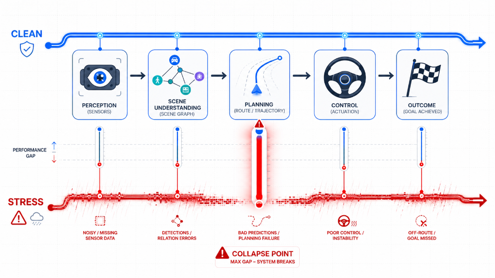
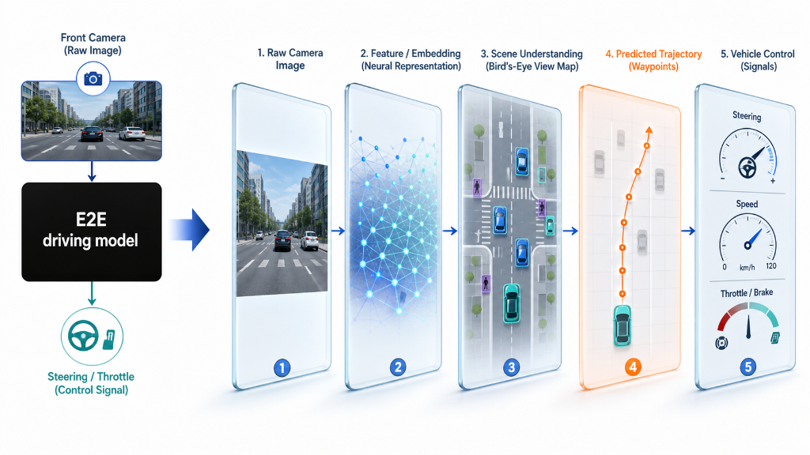
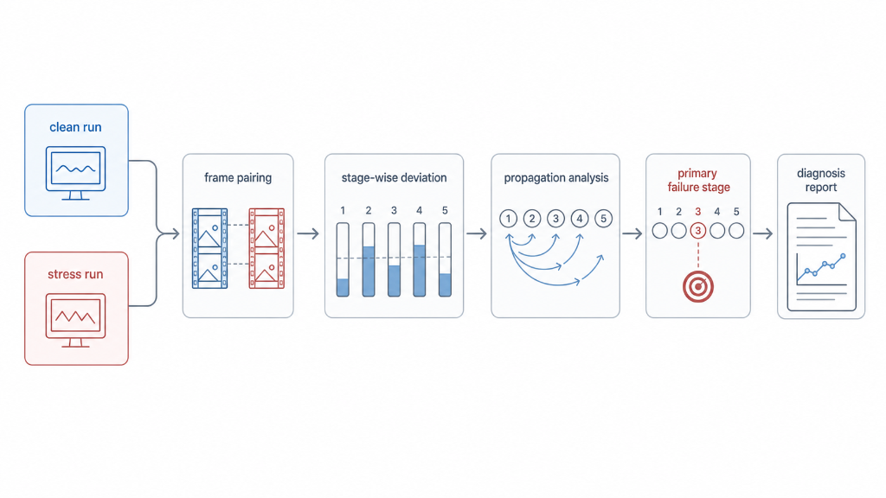
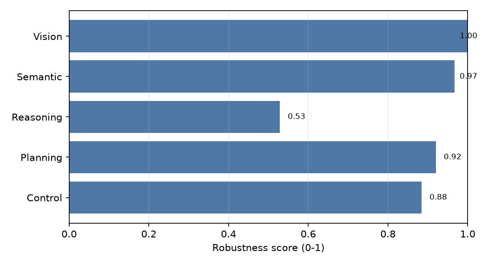
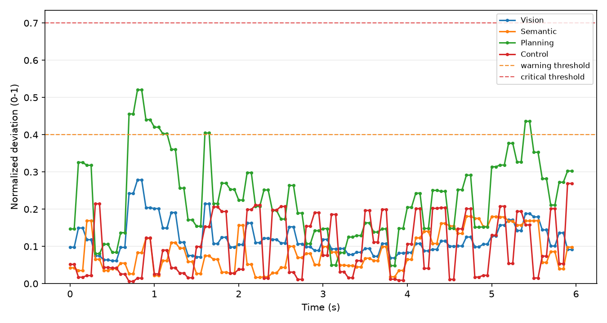
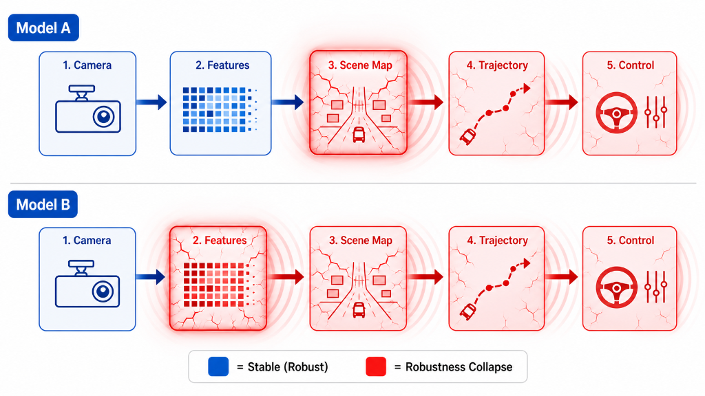
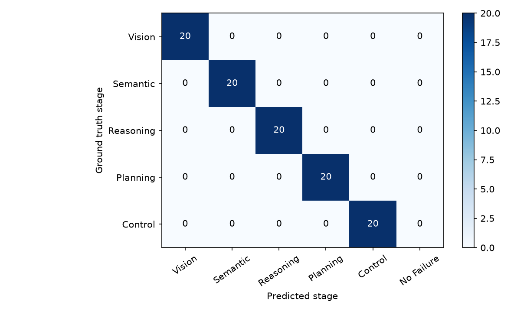

# SD2

**SD2 (System Deviation Diagnosis)** is a robustness diagnosis framework for **end-to-end (E2E) autonomous driving models**. It decomposes a driving system into a functional pipeline — **perception → scene understanding → planning → control → outcome** — runs the same scenario under clean and stressed conditions, measures how much each stage deviates, and localizes the stage where robustness *first* collapses and how the error propagates downstream.

Instead of asking *"how well does this model drive?"*, SD2 asks *"where in the pipeline does robustness collapse, and how does the error propagate?"*



Diagnosis outputs are **temporal-correlational**: SD2 identifies the earliest stage whose deviation crosses calibrated thresholds and is temporally followed by downstream deviation and/or driving-failure evidence. It does not claim a mechanistic root cause.

## What SD2 observes

A modern E2E model is a black box from sensors to actuation. SD2 "opens" it into observable functional stages and reads the intermediate state at each one — raw image, neural features, a bird's-eye scene map, the predicted trajectory, and the vehicle control signals:



## How it works

SD2 pairs a **clean run** with a **stress run** frame by frame, computes a normalized deviation per stage, analyzes how deviations propagate between adjacent stages, and diagnoses the **primary failure stage** — then writes a Markdown report:



## Example Output

Running the bundled demo on the sample logs (Gaussian noise, severity 3) produces a per-stage **robustness fingerprint** — higher is more robust:



The **deviation timeline** shows where robustness collapses first: vision stays stable while reasoning crosses the critical threshold at t=1.5s, followed by planning and control drift:



From this, the diagnosis module generates a natural-language summary:

> Under Gaussian Noise severity 3, the openemma model completed 92.0% of the route and experienced a collision and a lane invasion. The Reasoning stage showed the earliest critical deviation at t=1.500s (frame 15), preceding downstream Planning/Control deviation and the final driving failure. The primary_failure_stage label is Reasoning.

`diagnosis.json` includes `"diagnosis_type": "temporal_correlational"` to make this framing explicit.

See the full generated report at [docs/example/example_report.md](docs/example/example_report.md).

## Cross-architecture comparison

Because SD2 is architecture-agnostic, it can diagnose different E2E models under the *same* stress and reveal that they fail at *different* stages. On real CARLA closed-loop runs under Gaussian noise, **InterFuser** keeps a robust visual encoder but collapses at the **scene-understanding (semantic)** stage, while **TransFuser**'s fused feature is itself noise-sensitive so its collapse originates at the **vision/feature** stage and propagates downstream:



Details and the honest caveats are in [docs/example/cross_model_comparison.md](docs/example/cross_model_comparison.md).

### E2E models & source repositories

SD2 diagnoses six published E2E driving models. The model weights and code are
consumed read-only through gitignored `models/` junctions; nothing in this repo
redistributes them. Original sources:

| Model | Source repository | Paper (venue) | Sensors | SD2 stages observed |
| --- | --- | --- | --- | --- |
| **InterFuser** | [opendilab/InterFuser](https://github.com/opendilab/InterFuser) | Shao et al., CoRL 2022 | camera + LiDAR | vision, **semantic** (object density), planning, control |
| **TransFuser** | [autonomousvision/transfuser](https://github.com/autonomousvision/transfuser) | Chitta et al., CVPR 2021 / TPAMI 2023 | camera + LiDAR | vision, **semantic** (BEV-seg / detections), planning, control |
| **AIM** | [autonomousvision/transfuser](https://github.com/autonomousvision/transfuser) | Chitta et al., CVPR 2021 (baseline) | camera | vision, planning, control (no semantic head) |
| **CILRS** | [autonomousvision/transfuser](https://github.com/autonomousvision/transfuser) | Codevilla et al., ICCV 2019 (reimpl.) | camera | vision, control (no semantic / waypoints) |
| **NEAT** | [autonomousvision/neat](https://github.com/autonomousvision/neat) | Chitta et al., ICCV 2021 | multi-camera | vision, **semantic** (BEV occupancy), planning, control |
| **TCP** | [OpenDriveLab/TCP](https://github.com/OpenDriveLab/TCP) · weights [Thinklab-SJTU/Bench2DriveZoo](https://github.com/Thinklab-SJTU/Bench2DriveZoo) | Wu et al., NeurIPS 2022 | camera | vision, planning, control (no semantic head) |

## Validation: Synthetic Fault Injection Benchmark

SD2 includes a synthetic fault-injection benchmark for validating the diagnosis
framework itself. This is a framework sanity check, not a real-model experiment:
it creates clean/stress JSONL run pairs where the primary failure stage is known
by construction, runs the full `run_analysis` pipeline, and scores
`diagnosis.json` against the label.

The five labeled fault classes are:

- `vision`: large visual embedding cosine deviation
- `semantic`: object-set collapse plus critical-object and traffic-light flips
- `reasoning`: intent/text/critical-object mention mismatch
- `planning`: waypoint and target-speed divergence
- `control`: steer/throttle/brake command spike

Run the benchmark with:

```powershell
sd2 benchmark --config configs/mvp.yaml --output outputs/fault_benchmark --n-per-class 20 --seed 42
```

Or run the demo wrapper:

```powershell
python experiments/run_fault_benchmark.py
```

The default demo writes `benchmark_result.json`, `benchmark_report.md`, and
`confusion_matrix.png`. The current example result is 100.0% overall accuracy
with 100.0% per-class accuracy on all five synthetic classes; this indicates
that the implemented diagnosis policy matches the controlled synthetic origins.
See [docs/example/benchmark_report.md](docs/example/benchmark_report.md) and
the embedded confusion heatmap:



### Hard Benchmark Tier

The benchmark also has a hard profile with competing and ambiguous faults:
competing collapse, strong propagation, near-simultaneous adjacent collapse,
and noisy upstream distractors. These samples are labeled by the intended
origin stage, and near-simultaneous cases carry `ambiguous: true` in
`label.json`. The hard tier is meant to be discriminative, so accuracy below
100% is expected and should be reported honestly.

```powershell
sd2 benchmark --config configs/mvp.yaml --output outputs/fault_benchmark_hard --profile hard --n-per-class 20 --seed 42
```

Hard reports keep the confusion matrix and add per-ambiguity-type accuracy plus
an ambiguous-only accuracy slice.

### Reasoning Metric: Ablations and Known Limitations

The default reasoning metric remains `text_embedding_and_intent` with weights
`text_embedding=0.5`, `intent_mismatch=0.3`, and
`critical_object_mismatch=0.2`. Three ablation variants are registered for
review analysis: `reasoning_intent_only`, `reasoning_text_only`, and
`reasoning_critical_object_only`.

The current `text_embedding` component is a token-set Jaccard distance, not a
semantic embedding. It is intentionally documented as paraphrase-fragile:
same-meaning rewrites can score as large lexical deviations, while small word
edits can hide decision changes. Intent weighting mitigates this for the MVP,
and the ablation probe motivates a future embedding or judge-based upgrade.
See [docs/example/reasoning_ablation.md](docs/example/reasoning_ablation.md).

## Quickstart

Create and activate the conda environment:

```powershell
conda create -n sd2 python=3.12 -y
conda activate sd2
```

Install the package in editable mode:

```powershell
pip install -e .
```

Run the one-command MVP demo:

```powershell
python experiments/run_mvp.py
```

Or run analysis and report generation directly:

```powershell
python -m sd2.cli analyze --clean data/sample/clean_run.jsonl --stress data/sample/stress_run.jsonl --config configs/mvp.yaml --output outputs/sample_analysis --report
```

Calibrate warning/critical thresholds from repeated clean runs:

```powershell
python -m sd2.cli calibrate --clean clean_a.jsonl --clean clean_b.jsonl --clean clean_c.jsonl --config configs/mvp.yaml --output outputs/calibration
```

Consume calibrated per-stage thresholds during analysis:

```powershell
python -m sd2.cli analyze --clean data/sample/clean_run.jsonl --stress data/sample/stress_run.jsonl --config configs/mvp.yaml --thresholds outputs/calibration/calibrated_thresholds.json --output outputs/sample_analysis_calibrated --report
```

Generate a report from an existing analysis directory:

```powershell
python -m sd2.cli report --analysis-dir outputs/sample_analysis
```

Aggregate one or more fingerprint outputs:

```powershell
python -m sd2.cli fingerprint --analysis-dir outputs --output outputs/fingerprint_summary.md
```

Generate deterministic sample images and apply a stressor:

```powershell
python experiments/generate_sample_images.py
python -m sd2.cli stress --input data/sample/images --config configs/stress/gaussian_noise.yaml --output outputs/stress_demo --seed 42
```

Run tests:

```powershell
conda run -n sd2 python -m pytest -q
```

If Windows temp permissions interfere with pytest, use:

```powershell
conda run -n sd2 python -m pytest -q --basetemp .pytest_basetemp
```

## Pairing Anchors

Clean and stress runs are paired by `pairing.mode` in the YAML config. The
default is `frame_idx`, which preserves the original MVP behavior: only equal
frame indices are paired, and the pair key remains
`model_id:scenario_id:seed:<clean_frame_idx>`.

Two alternate clean-centric anchors are available for closed-loop runs where
stress can change the ego trajectory. `timestamp` pairs each clean frame with
the nearest stress timestamp within `pairing.timestamp_tolerance` seconds.
`route_progress` pairs each clean frame with the nearest stress
`outcome.route_progress` within `pairing.progress_tolerance`; this is useful
when heavy stress makes the ego lag, drift, or reach intersections at different
frame numbers. Route-progress mode requires `outcome.route_progress` on both
runs; otherwise use `frame_idx`.

For every mode, emitted pairs keep the clean frame's `frame_idx` and
`timestamp`, so deviation timelines, propagation, and onset logic remain on the
clean-run timeline. `pairing_summary.json` reports `mode`,
`mean_anchor_mismatch`, and `max_anchor_mismatch`; units are frame-index delta
for `frame_idx` (always `0.0`), seconds for `timestamp`, and route-progress
fraction for `route_progress`. This addresses the known caveat that pure
frame-index pairing can misalign comparable driving states under heavy stress.

## CARLA Logging (Real Closed-Loop)

CARLA is not a core package dependency because its wheel is local and
platform-specific. Install CARLA 0.9.16 manually inside the `sd2` environment:

```powershell
pip install external/Carla/CARLA_0.9.16/PythonAPI/carla/dist/carla-0.9.16-*.whl
```

The recording client drives with CARLA's `BasicAgent`, which requires two extra
packages:

```powershell
pip install shapely networkx
```

Launch the CARLA server from the CARLA install directory:

```powershell
CarlaUE4.exe -quality-level=Low -RenderOffScreen -carla-rpc-port=2000
```

Record a clean run:

```powershell
python experiments/carla_record.py --host localhost --port 2000 --town Town10HD_Opt --frames 200 --warmup 20 --seed 42 --delta 0.05 --stress none --output data/carla/town10_clean_seed42.jsonl --spawn-index 0
```

Record a matched `control_noise` stress run with the same seed, town, frame
count, and spawn index:

```powershell
python experiments/carla_record.py --host localhost --port 2000 --town Town10HD_Opt --frames 200 --warmup 20 --seed 42 --delta 0.05 --stress control_noise --stress-severity 3 --output data/carla/town10_control_noise_s3_seed42.jsonl --spawn-index 0
```

Analyze the pair:

```powershell
sd2 analyze --clean data/carla/town10_clean_seed42.jsonl --stress data/carla/town10_control_noise_s3_seed42.jsonl --config configs/mvp.yaml --output outputs/carla_control_noise_s3 --report
```

The CARLA recorder currently populates only Planning, Control, and Outcome
states: waypoints, target speed, ego pose/speed, vehicle controls, collision,
lane invasion, route progress, and optional TTC. Vision, Semantic, and
Reasoning are intentionally absent until a model adapter is available, so these
logs are Observability Tier 0/1. Clean and stress runs are designed to pair by
`frame_idx`; severe weather or control noise can still make the closed-loop
trajectory diverge, so frame pairing is an alignment convention for analysis.

## E2E Model Diagnosis (InterFuser)

SD2 can record InterFuser, an E2E camera+lidar model, in CARLA and emit Tier
2/3 logs with Vision, Semantic, Planning, Control, and Outcome populated. The
recorder is [experiments/interfuser_record.py](experiments/interfuser_record.py);
the CARLA-free conversion module is
[src/sd2/adapters/interfuser_adapter.py](src/sd2/adapters/interfuser_adapter.py).

`models/InterFuser/` is expected to be a local junction to the InterFuser repo
and remains gitignored. The script applies the verified inference preamble
internally: it stubs `imgaug`, prepends `models/InterFuser/interfuser` so the
vendored `timm 0.4.13` wins, and prepends the InterFuser `leaderboard` and
`scenario_runner` paths. The default checkpoint is:

```text
F:/coding/Autonomous Vehicle/MARSHAL/Models/InterFuser_ckpt/interfuser.pth
```

The recorder attaches the InterFuser sensor rig from the leaderboard agent:
front RGB `800x600` fov `100`, left/right RGB `400x300` yaw `-60/+60`, lidar
`ray_cast` yaw `-90`, IMU, GNSS, and a speedometer measurement derived from the
ego velocity. Visual stressors are applied to RGB frames before InterFuser
preprocessing and inference, so the perturbation can propagate through
semantic prediction, planning, control, and outcome.

Record a clean InterFuser run:

```powershell
python experiments/interfuser_record.py --host localhost --port 2000 --town Town10HD_Opt --frames 300 --warmup 20 --seed 42 --delta 0.05 --checkpoint "F:/coding/Autonomous Vehicle/MARSHAL/Models/InterFuser_ckpt/interfuser.pth" --stress none --output data/carla/interfuser_town10_clean_seed42.jsonl --spawn-index 0
```

Record a matched Gaussian-noise stress run with the same seed, town, frame
count, and spawn index:

```powershell
python experiments/interfuser_record.py --host localhost --port 2000 --town Town10HD_Opt --frames 300 --warmup 20 --seed 42 --delta 0.05 --checkpoint "F:/coding/Autonomous Vehicle/MARSHAL/Models/InterFuser_ckpt/interfuser.pth" --stress gaussian_noise --stress-severity 3 --output data/carla/interfuser_town10_gaussian_noise_s3_seed42.jsonl --spawn-index 0
```

Analyze the pair:

```powershell
sd2 analyze --clean data/carla/interfuser_town10_clean_seed42.jsonl --stress data/carla/interfuser_town10_gaussian_noise_s3_seed42.jsonl --config configs/mvp.yaml --output outputs/interfuser_town10_gaussian_noise_s3 --report
```

Stage mapping:

- `vision`: mean-pooled InterFuser `traffic_feature`/BEV feature as `feature`
  for `embedding_cosine`, plus front-camera `image_mean` and `image_std`
  fallback.
- `semantic`: tracked `traffic_meta` object counts/classes, occupied-cell
  density, junction probability, traffic-light score, and stop-sign score.
- `planning`: predicted waypoints, controller target speed, route command, and
  local target point.
- `control`: `InterfuserController` steer, throttle, and brake.
- `outcome`: CARLA collision and lane-invasion events, route progress, and
  optional TTC placeholder.

The script logs first-tick sensor shapes, model input tensor shapes, and model
output shapes before recording frames, which is the first place to look if a
live CARLA run has an input-shape mismatch.

### TransFuser

SD2 also records TransFuser as a second E2E architecture for RQ3-style
cross-architecture failure comparison: clean/stress runs can be collected with
the same CARLA town, seed, route, frame count, and visual stressor, then
compared against InterFuser fingerprints using the same SD2 stage schema.

The recorder is
[experiments/transfuser_record.py](experiments/transfuser_record.py); the
CARLA-free conversion module is
[src/sd2/adapters/transfuser_adapter.py](src/sd2/adapters/transfuser_adapter.py).
`models/TransFuser/` is expected to be a local gitignored junction to the
TransFuser checkout. The default checkpoint directory is:

```text
models/TransFuser/checkpoints/models_2022/transfuser
```

The script follows the verified TransFuser load recipe: it prepends only
`models/TransFuser/TransFuser_UI_V2/transfuser/team_code_transfuser`, imports
`GlobalConfig` and `LidarCenterNet`, reads `args.txt`, loads
`model_seed1_39.pth`, strips the `module.` DDP prefix, and uses the installed
standard `timm` package. It does not prepend InterFuser's vendored `timm` path;
`mmcv` and `torch_scatter` remain optional because the TransFuser model file has
fallbacks for this inference path.

The recorder attaches the TransFuser sensor rig from the submission agent:
front/left/right RGB cameras `960x480` fov `120` at yaw `0/-60/+60`, IMU, GNSS,
a speedometer measurement derived from ego velocity, and lidar `ray_cast` at the
configured lidar pose for the `transFuser` backbone. Visual stressors are
applied to the RGB camera frames before TransFuser preprocessing, target-point
image generation, `forward_ego`, and `control_pid`.

Record a clean TransFuser run:

```powershell
python experiments/transfuser_record.py --host localhost --port 2000 --town Town10HD_Opt --frames 300 --warmup 20 --seed 42 --delta 0.05 --checkpoint models/TransFuser/checkpoints/models_2022/transfuser --stress none --output data/carla/transfuser_town10_clean_seed42.jsonl --spawn-index 0
```

Record a matched Gaussian-noise stress run with the same seed, town, frame
count, and spawn index:

```powershell
python experiments/transfuser_record.py --host localhost --port 2000 --town Town10HD_Opt --frames 300 --warmup 20 --seed 42 --delta 0.05 --checkpoint models/TransFuser/checkpoints/models_2022/transfuser --stress gaussian_noise --stress-severity 3 --output data/carla/transfuser_town10_gaussian_noise_s3_seed42.jsonl --spawn-index 0
```

Analyze the pair:

```powershell
sd2 analyze --clean data/carla/transfuser_town10_clean_seed42.jsonl --stress data/carla/transfuser_town10_gaussian_noise_s3_seed42.jsonl --config configs/mvp.yaml --output outputs/transfuser_town10_gaussian_noise_s3 --report
```

Aggregate InterFuser and TransFuser fingerprints for cross-model comparison:

```powershell
sd2 fingerprint --analysis-dir outputs --output outputs/e2e_fingerprint_summary.md
```

Stage mapping:

- `vision`: TransFuser fused image/LiDAR backbone embedding before the waypoint
  GRU as `feature` for `embedding_cosine`, plus three-camera `image_mean` and
  `image_std` fallback.
- `semantic`: `rotated_bb` detections from the CenterNet branch, converted to
  vehicle objects, per-class counts, occupancy/density summary, confidence
  summary, and optional BEV segmentation summary.
- `planning`: `pred_wp` waypoints, target-speed proxy from waypoint spacing,
  route command, local target point, and stuck-state flag.
- `control`: `LidarCenterNet.control_pid` steer, throttle, and brake after the
  TransFuser action-repeat/stuck/safety logic.
- `outcome`: CARLA collision and lane-invasion events, route progress, and
  optional TTC placeholder.

The TransFuser and InterFuser adapters both emit Vision, Semantic, Planning,
Control, and Outcome with the same SD2 stage names, so `sd2 analyze` and
`sd2 fingerprint` can compare the two architectures under matched visual stress.

#### Making TransFuser drive (anti-crawl creep)

Out of the box in open-world closed loop (no leaderboard scenario), TransFuser —
like the AIM/CILRS/TCP baselines — falls into a **cold-start crawl limit-cycle**:
from a standstill the model predicts short waypoints, so `control_pid` derives a
low desired speed and brakes; the ego briefly creeps, overshoots the tiny
desired speed, brakes hard, and stops again. Route progress stalls near zero and
the planning/control deviations end up measured on a near-stationary ego.

The `--debug-driving` diagnosis (per-tick `speed`, `is_stuck`, `stuck_detector`,
`forced_move`, `emergency_stop`, safety-box point count, `target_point`, and the
first/last predicted waypoint) confirmed the cause on a live run: the LiDAR
safety brake never fires (`emergency_stop=False`, `safety_pts=0`) and the
`target_point`/waypoint frames are correct — the ego is simply trapped by its own
low predicted speed. TransFuser already ships a **creep controller** (it forces
`default_speed ≈ 4 m/s` while `is_stuck`), but its stuck trigger
(`stuck_threshold = 1100` frames of near-zero speed) never fires during a crawl.

The recorder exposes the creep so it can engage in the crawl regime:

- `--creep-speed S` — count a frame toward the stuck detector when speed `< S`
  (default `0.1` = original "only truly stopped"; set `2.5` to treat crawling as
  stuck). The detector only resets once the ego is clearly moving above `S`.
- `--creep-threshold N` — engage the creep after `N` sub-`creep-speed` frames
  (overrides `config.stuck_threshold`).
- `--creep-duration N` — how many frames each forced-move creep lasts
  (overrides `config.creep_duration`).
- `--debug-driving` / `--no-lidar-safe-check` remain available for diagnosis.

With the settings below, TransFuser drives the route at a sustained ~4 m/s and
completes ~85% of it (matching NEAT), so its stage deviations are measured on a
properly moving ego:

```powershell
# clean + gaussian-noise, anti-crawl creep engaged
python experiments/transfuser_record.py --host localhost --port 2000 --town Town10HD_Opt --frames 120 --warmup 20 --seed 42 --checkpoint models/TransFuser/checkpoints/models_2022/transfuser --stress none --creep-speed 2.5 --creep-threshold 5 --creep-duration 60 --output data/carla/transfuser_town10_clean_seed42.jsonl --spawn-index 0
python experiments/transfuser_record.py --host localhost --port 2000 --town Town10HD_Opt --frames 120 --warmup 20 --seed 42 --checkpoint models/TransFuser/checkpoints/models_2022/transfuser --stress gaussian_noise --stress-severity 3 --creep-speed 2.5 --creep-threshold 5 --creep-duration 60 --output data/carla/transfuser_town10_gaussian_noise_s3_seed42.jsonl --spawn-index 0
sd2 analyze --clean data/carla/transfuser_town10_clean_seed42.jsonl --stress data/carla/transfuser_town10_gaussian_noise_s3_seed42.jsonl --config configs/mvp.yaml --output outputs/transfuser_town10_gaussian_noise_s3 --report
```

The creep is TransFuser's own mechanism; `--creep-speed`/`--creep-threshold` only
change *when* it engages, not the model's predictions. The same cold-start crawl
affects the AIM/CILRS/TCP camera baselines (NEAT escapes it on its own); those
recorders instead take a generic `--anti-crawl` flag that nudges the *applied*
throttle to give the ego a rolling start — see the next section.

If run (2) drives but (1) does not, the LiDAR safety box is the culprit; if
`emergency_stop=False` throughout but `brake` stays high with sane waypoints,
the fix is in the target-point/route frame rather than the safety logic.

### Classic TransFuser-CVPR'21 Baselines

SD2 also records three classic baselines from the TransFuser-CVPR'21 codebase
using the same clean/stress pairing and SD2 stage schema:

- **AIM**: camera-only imitation model; SD2 observes front-image encoder
  features, predicted waypoints, PID control, and outcome. AIM has no semantic
  head, so the semantic stage is absent/unobserved.
- **CILRS**: camera-only conditional imitation model; SD2 observes front-image
  encoder features, predicted velocity as the planning target-speed signal,
  direct control, and outcome. CILRS has no semantic head, so the semantic stage
  is absent/unobserved.
- **NEAT**: attention-field model; SD2 observes multi-camera encoder features,
  decoded BEV occupancy semantics (`bev_seg_summary`), predicted waypoints, PID
  control, and outcome. NEAT contributes a BEV-seg semantic signal like
  TransFuser.
- **TCP**: Bench2Drive trajectory+control dual-branch model; SD2 observes
  front-image backbone features, `pred_wp` waypoints, final gated control plus
  raw trajectory/control branch actions, and outcome. TCP is fed a single front
  camera resized/sized to `256x900` instead of the original three-camera mosaic,
  and has no semantic head, so the semantic stage is absent/unobserved.

`models/AIM/`, `models/CILRS/`, `models/NEAT/`, and `models/TCP/` are expected
to be local gitignored junctions/checkouts. The default checkpoints are:

```text
models/AIM/aim/best_model.pth
models/CILRS/cilrs/best_model.pth
models/NEAT/neat/best_encoder.pth
models/NEAT/neat/best_decoder.pth
models/NEAT/neat/args.txt
models/TCP/checkpoints/tcp_b2d.ckpt
```

**Anti-crawl (recommended).** AIM, CILRS, and TCP have no native creep
controller, so from a standstill they fall into the same cold-start crawl
limit-cycle described above and route progress stalls near zero. Their recorders
accept a generic `--anti-crawl` flag that gives the ego a rolling start by
nudging the **applied** throttle in sustained bursts while it crawls; the
**recorded** control stage still holds the model's raw steer/throttle/brake, so
the clean-vs-stress control comparison stays a pure model measurement. With
`--anti-crawl --creep-speed 2.5 --creep-frames 4 --creep-throttle 0.6 --creep-duration 40`,
all three complete ~85–90% of the route at a moving speed. Flags:
`--creep-speed` (crawl threshold m/s), `--creep-frames` (crawl frames before a
burst), `--creep-throttle` (burst throttle), `--creep-duration` (burst length).

Record and analyze AIM (with anti-crawl):

```powershell
python experiments/aim_record.py --host localhost --port 2000 --town Town10HD_Opt --frames 300 --warmup 20 --seed 42 --delta 0.05 --checkpoint models/AIM/aim/best_model.pth --stress none --anti-crawl --creep-speed 2.5 --creep-frames 4 --creep-throttle 0.6 --creep-duration 40 --output data/carla/aim_town10_clean_seed42.jsonl --spawn-index 0
python experiments/aim_record.py --host localhost --port 2000 --town Town10HD_Opt --frames 300 --warmup 20 --seed 42 --delta 0.05 --checkpoint models/AIM/aim/best_model.pth --stress gaussian_noise --stress-severity 3 --output data/carla/aim_town10_gaussian_noise_s3_seed42.jsonl --spawn-index 0
sd2 analyze --clean data/carla/aim_town10_clean_seed42.jsonl --stress data/carla/aim_town10_gaussian_noise_s3_seed42.jsonl --config configs/mvp.yaml --output outputs/aim_town10_gaussian_noise_s3 --report
```

Record and analyze CILRS:

```powershell
python experiments/cilrs_record.py --host localhost --port 2000 --town Town10HD_Opt --frames 300 --warmup 20 --seed 42 --delta 0.05 --checkpoint models/CILRS/cilrs/best_model.pth --stress none --output data/carla/cilrs_town10_clean_seed42.jsonl --spawn-index 0
python experiments/cilrs_record.py --host localhost --port 2000 --town Town10HD_Opt --frames 300 --warmup 20 --seed 42 --delta 0.05 --checkpoint models/CILRS/cilrs/best_model.pth --stress gaussian_noise --stress-severity 3 --output data/carla/cilrs_town10_gaussian_noise_s3_seed42.jsonl --spawn-index 0
sd2 analyze --clean data/carla/cilrs_town10_clean_seed42.jsonl --stress data/carla/cilrs_town10_gaussian_noise_s3_seed42.jsonl --config configs/mvp.yaml --output outputs/cilrs_town10_gaussian_noise_s3 --report
```

Record and analyze NEAT:

```powershell
python experiments/neat_record.py --host localhost --port 2000 --town Town10HD_Opt --frames 300 --warmup 20 --seed 42 --delta 0.05 --checkpoint models/NEAT/neat --stress none --output data/carla/neat_town10_clean_seed42.jsonl --spawn-index 0
python experiments/neat_record.py --host localhost --port 2000 --town Town10HD_Opt --frames 300 --warmup 20 --seed 42 --delta 0.05 --checkpoint models/NEAT/neat --stress gaussian_noise --stress-severity 3 --output data/carla/neat_town10_gaussian_noise_s3_seed42.jsonl --spawn-index 0
sd2 analyze --clean data/carla/neat_town10_clean_seed42.jsonl --stress data/carla/neat_town10_gaussian_noise_s3_seed42.jsonl --config configs/mvp.yaml --output outputs/neat_town10_gaussian_noise_s3 --report
```

Record and analyze TCP:

```powershell
python experiments/tcp_record.py --host localhost --port 2000 --town Town10HD_Opt --frames 300 --warmup 20 --seed 42 --delta 0.05 --checkpoint models/TCP/checkpoints/tcp_b2d.ckpt --planner-type only_traj --stress none --output data/carla/tcp_town10_clean_seed42.jsonl --spawn-index 0
python experiments/tcp_record.py --host localhost --port 2000 --town Town10HD_Opt --frames 300 --warmup 20 --seed 42 --delta 0.05 --checkpoint models/TCP/checkpoints/tcp_b2d.ckpt --planner-type only_traj --stress gaussian_noise --stress-severity 3 --output data/carla/tcp_town10_gaussian_noise_s3_seed42.jsonl --spawn-index 0
sd2 analyze --clean data/carla/tcp_town10_clean_seed42.jsonl --stress data/carla/tcp_town10_gaussian_noise_s3_seed42.jsonl --config configs/mvp.yaml --output outputs/tcp_town10_gaussian_noise_s3 --report
```

TCP stage mapping:

- `vision`: mean-pooled TCP ResNet/perception feature as `feature`, plus
  single-front-camera `image_mean` and `image_std` fallback.
- `semantic`: absent/unobserved; TCP has no explicit semantic head.
- `planning`: `pred_wp` future waypoints (`pred_len=4`), control-PID
  `desired_speed` as `target_speed`, route command, and local target point.
- `control`: final steer/throttle/brake after TCP planner selection, throttle
  clamp, and brake gating, with raw trajectory-branch and control-branch
  steer/throttle/brake preserved in `details`.
- `outcome`: CARLA collision and lane-invasion events, route progress, and
  optional TTC placeholder.

Aggregate all E2E fingerprints:

```powershell
sd2 fingerprint --analysis-dir outputs --output outputs/e2e_fingerprint_summary.md
sd2 aggregate --analysis-dir outputs --output outputs/e2e_aggregate.md
```

### Calibrated thresholds on real data

Real CARLA drives have natural run-to-run variation (engine non-determinism),
so repeated clean runs give a meaningful clean-clean baseline. Record several
clean runs and calibrate per-stage thresholds, then analyze the stress pair
with them:

```powershell
sd2 calibrate --clean data/carla/calib/clean_rep1.jsonl --clean data/carla/calib/clean_rep2.jsonl --clean data/carla/calib/clean_rep3.jsonl --config configs/mvp.yaml --output data/carla/calib/calibrated_thresholds.json
sd2 analyze --clean data/carla/town10_clean_seed42.jsonl --stress data/carla/town10_control_noise_s3_seed42.jsonl --config configs/mvp.yaml --thresholds data/carla/calib/calibrated_thresholds.json --output outputs/carla_control_noise_s3_calibrated --report
```

On the bundled `control_noise` example this matters: the static `0.4/0.7`
thresholds are far above the real clean-clean deviation (Planning/Control
critical calibrate to about `0.06-0.07`), and a single-frame Planning spike
would otherwise be mistaken for the primary failure. With calibrated thresholds
plus the `onset_persistence_frames` requirement (a collapse onset must persist
for several consecutive frames, filtering outlier spikes), the diagnosis
correctly identifies **Control** — the stage that was actually perturbed — as
the primary failure stage.

## Expected Outputs

The demo writes:

- `outputs/sample_analysis/paired_frames.json`
- `outputs/sample_analysis/pairing_summary.json`
- `outputs/sample_analysis/deviation_table.json`
- `outputs/sample_analysis/deviation_table.csv`
- `outputs/sample_analysis/propagation.json`
- `outputs/sample_analysis/diagnosis.json`
- `outputs/sample_analysis/fingerprint.json`
- `outputs/sample_analysis/report.md`
- `outputs/sample_analysis/plots/deviation_timeline.png`
- `outputs/sample_analysis/plots/robustness_fingerprint.png`
- `outputs/sample_analysis/plots/propagation_scores.png`

Calibration writes `calibrated_thresholds.json`, containing per-stage clean-clean mean/std, warning/critical thresholds computed as `mean + k * std`, and fallback flags for stages whose clean-clean variance is near zero.

A copy of the demo output (report and plots) is kept under [docs/example/](docs/example/) for reference.

## Stressors

Stressors perturb clean image inputs to produce offline stress-run inputs. Severity is an integer from `1` to `5`; `0` and out-of-range values are rejected. Each stressor maps that severity to concrete parameters internally and records those parameters in `stress_manifest.json`.

Visual stressors operate on `HxWx3` RGB `uint8` images and write the same filenames to the output directory:

- `gaussian_noise`
- `motion_blur`
- `fog`
- `brightness_shift`
- `contrast_shift`
- `jpeg_compression`
- `low_light`

Temporal stressors operate on the sorted image list as a frame sequence:

- `frame_drop`
- `frame_delay`
- `camera_blackout`
- `low_fps`

For temporal materialization, dropped frames are omitted, camera blackouts are written as black images, and delayed frames hold earlier source images at the current output position. Run a stress pass with:

```powershell
python -m sd2.cli stress --input <image-dir> --config <stress-yaml> --output <output-dir> --seed 42
```

Existing stress configs live in `configs/stress/`, for example `gaussian_noise.yaml`, `motion_blur.yaml`, and `frame_drop.yaml`.

## Current Status

MVP Phase 1 through the offline stressor layer are complete:

- src-layout Python package scaffold
- Pydantic v2 run and frame schema
- deterministic JSONL sample data
- deterministic sample image generator for stressor demos
- JSONL run loader with line-numbered validation errors
- clean/stress frame pairing with skipped-frame summary and saved run metadata
- stage-wise metric registry and MVP metrics for vision, semantic, reasoning, planning, and control stages
- visual and temporal stressor registry with `sd2 stress` CLI materialization
- min-max clipping and threshold status classification (`healthy`, `warning`, `critical`)
- optional clean-clean threshold calibration with `sd2 calibrate` and `sd2 analyze --thresholds`
- propagation analysis with adjacent-stage robust evidence bundles: legacy ratio, clipped ratio, log-ratio, absolute increase, collapse order, and downstream persistence
- temporal-correlational failure-stage labeling using `first_critical_with_downstream_increase`, with documented fallbacks
- per-run robustness fingerprint where each observed stage score is `1 - mean(normalized deviation)`
- Markdown report generation with stage timeline, fingerprint, and propagation plots
- `sd2 analyze --report`, `sd2 report`, and `sd2 fingerprint` CLI flows
- `experiments/run_mvp.py` one-command demo
- labeled synthetic fault-injection benchmark with `sd2 benchmark`
- hard/ambiguous synthetic benchmark profile with per-ambiguity reporting
- reasoning metric ablations and paraphrase-robustness probe
- `experiments/run_fault_benchmark.py` one-command validation demo
- CARLA InterFuser, TransFuser, AIM, CILRS, and NEAT E2E recorders plus pure
  SD2 adapters for stage-wise diagnosis

The synthetic benchmark validates the SD2 diagnosis machinery on controlled
offline logs; it does not replace real-model robustness experiments.

## Metric Config

Metrics are selected per stage in `configs/mvp.yaml` under `metrics`:

- `embedding_cosine` for `vision`: cosine distance over `embedding` or `feature`.
- `object_jaccard` for `semantic`: object-set Jaccard distance with missing/extra object, critical-object mismatch, and traffic-light mismatch details.
- `text_embedding_and_intent` for `reasoning`: weighted lexical token-set distance, intent mismatch, and critical-object mention mismatch.
- `waypoint_ade` for `planning`: ADE over common waypoint prefix, with FDE and target-speed difference details.
- `weighted_action_mae` for `control`: weighted absolute steer/throttle/brake error.
