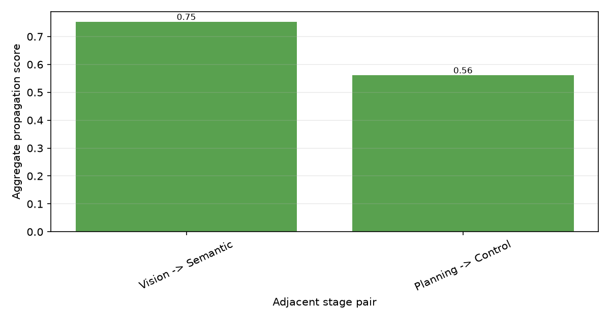

# SD2 Failure Diagnosis Report

| Field | Value |
| --- | --- |
| Model | openemma |
| Scenario | town05_route01 |
| Condition | stress |
| Stress Type | gaussian_noise |
| Severity | 3 |
| Seed | 42 |

## Summary Diagnosis

Under Gaussian Noise severity 3, the openemma model completed 92.0% of the route and experienced a collision and a lane invasion. The Reasoning stage showed the earliest critical deviation at t=1.500s (frame 15), preceding downstream Planning and Control deviation and the final driving failure. Downstream deviation increases followed the Reasoning onset in the order Planning (+0.080) and Control (+0.088). The primary_failure_stage label is Reasoning. Upstream perception did not show an earlier critical deviation; reasoning-stage deviation was followed by planning/control deviation.

Diagnosis type: temporal-correlational; this report identifies the earliest-collapsing stage by timing, not mechanistic proof.

## Final Outcome Comparison

| Metric | Clean | Stress | Delta |
| --- | --- | --- | --- |
| Collision | no | yes | n/a |
| Lane invasion | no | yes | n/a |
| Route progress | 100.0% | 92.0% | 8.0 pp |

## Stage-wise Mean Deviation

| Stage | Mean | Max | Status | Samples |
| --- | --- | --- | --- | --- |
| Vision | 0.001 | 0.005 | healthy | 30 |
| Semantic | 0.033 | 0.250 | healthy | 30 |
| Reasoning | 0.471 | 0.950 | warning | 30 |
| Planning | 0.080 | 0.300 | healthy | 30 |
| Control | 0.116 | 0.409 | healthy | 30 |

## Collapse Onset Times

| Stage | Warning Onset | Critical Onset |
| --- | --- | --- |
| Vision | n/a | n/a |
| Semantic | n/a | n/a |
| Reasoning | t=1.500s, frame 15, score 0.950 | t=1.500s, frame 15, score 0.950 |
| Planning | n/a | n/a |
| Control | t=2.800s, frame 28, score 0.404 | n/a |

## Propagation Summary

| Edge | Legacy Ratio | Clipped Ratio | Log Ratio | Absolute Increase | Persistence | Lag |
| --- | --- | --- | --- | --- | --- | --- |
| Vision -> Semantic | n/a | n/a | n/a | n/a | n/a | 0 |
| Semantic -> Reasoning | 3.800 | 3.800 | 1.335 | n/a | n/a | 0 |
| Reasoning -> Planning | 0.170 | 0.170 | -1.993 | -0.783 | 0.000 | 0 |
| Planning -> Control | 1.349 | 1.349 | 0.249 | n/a | n/a | 0 |

## Robustness Fingerprint


| Stage | Robustness |
| --- | --- |
| Vision | 0.999 |
| Semantic | 0.967 |
| Reasoning | 0.529 |
| Planning | 0.920 |
| Control | 0.884 |
| Mean | 0.860 |
| Run count | 1 |

```text
openemma Robustness Fingerprint

Vision:      [##########] 1.00
Semantic:    [##########] 0.97
Reasoning:   [#####-----] 0.53
Planning:    [#########-] 0.92
Control:     [#########-] 0.88
```

## Embedded Plots



