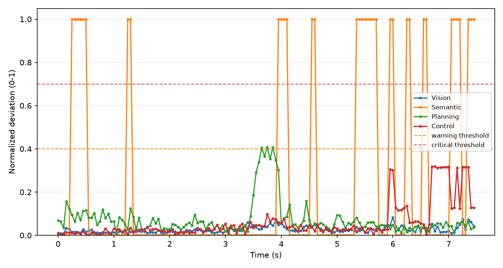

# SD2 Failure Diagnosis Report

| Field | Value |
| --- | --- |
| Model | interfuser |
| Scenario | Town10HD_Opt_spawn0_dest77 |
| Condition | stress |
| Stress Type | gaussian_noise |
| Severity | 3 |
| Seed | 42 |

## Summary Diagnosis

Under Gaussian Noise severity 3, the interfuser model completed 79.1% of the route and did not record a collision or lane invasion. The Semantic stage showed the earliest critical deviation at t=0.250s (frame 5), preceding downstream Planning and Control deviation and no driving-failure event. Downstream deviation increases followed the Semantic onset in the order Planning (+0.004) and Control (+0.000). The primary_failure_stage label is Semantic. Semantic was the earliest stage to cross the critical deviation threshold, while downstream stages stayed below the warning level.

Diagnosis type: temporal-correlational; this report identifies the earliest-collapsing stage by timing, not mechanistic proof.

## Final Outcome Comparison

| Metric | Clean | Stress | Delta |
| --- | --- | --- | --- |
| Collision | no | no | n/a |
| Lane invasion | no | no | n/a |
| Route progress | 78.7% | 79.1% | -0.5 pp |

## Stage-wise Mean Deviation

| Stage | Mean | Max | Status | Samples |
| --- | --- | --- | --- | --- |
| Vision | 0.026 | 0.083 | healthy | 150 |
| Semantic | 0.233 | 1.000 | healthy | 150 |
| Planning | 0.073 | 0.407 | healthy | 150 |
| Control | 0.060 | 0.319 | healthy | 150 |

## Collapse Onset Times

| Stage | Warning Onset | Critical Onset |
| --- | --- | --- |
| Vision | n/a | n/a |
| Semantic | t=0.250s, frame 5, score 1.000 | t=0.250s, frame 5, score 1.000 |
| Reasoning | n/a | n/a |
| Planning | n/a | n/a |
| Control | n/a | n/a |

## Propagation Summary

| Edge | Legacy Ratio | Clipped Ratio | Log Ratio | Absolute Increase | Persistence | Lag |
| --- | --- | --- | --- | --- | --- | --- |
| Vision -> Semantic | 7.791 | 5.000 | -4.147 | n/a | n/a | 0 |
| Semantic -> Reasoning | n/a | n/a | n/a | n/a | n/a | 0 |
| Reasoning -> Planning | n/a | n/a | n/a | n/a | n/a | 0 |
| Planning -> Control | 0.730 | 0.730 | -1.173 | n/a | n/a | 0 |

## Robustness Fingerprint


| Stage | Robustness |
| --- | --- |
| Vision | 0.974 |
| Semantic | 0.767 |
| Reasoning | n/a |
| Planning | 0.927 |
| Control | 0.940 |
| Mean | 0.902 |
| Run count | 1 |

```text
interfuser Robustness Fingerprint

Vision:      [##########] 0.97
Semantic:    [########--] 0.77
Reasoning:   [??????????] n/a
Planning:    [#########-] 0.93
Control:     [#########-] 0.94
```

## Embedded Plots




